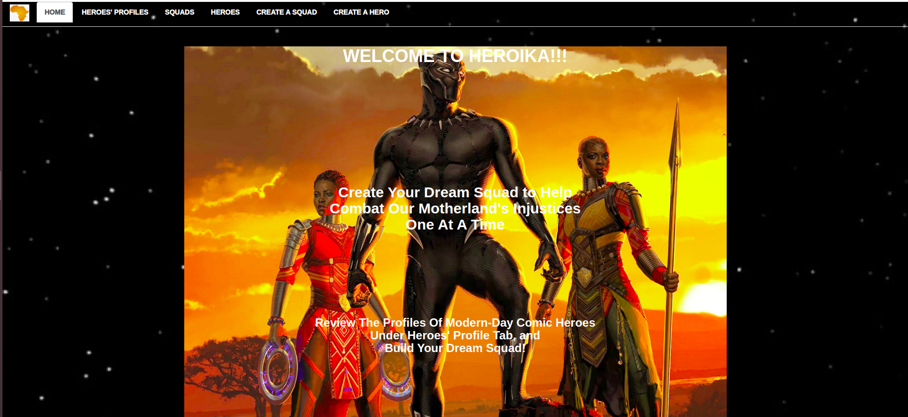

# Heroika!

## Author

Njoki Kamau
 
 
 
 ## Link to Deployed Site
 [Deployed Site](heroika.herokuapp.com/)

 ## BDD
 
|Behavior | Input| Output|   
|---------|------|-------|
|Attach different heroes to the form| User puts in details of Squad| Pre-determined heroes are grabbed and displayed, when checkbox is checked|
|User is able to create a squad object| use forms| squad object created is stored for reference|
|The squad created is stored as data and displayed in different page, retrievable| use postgress or SQL| the users creation are availabe even after refresh.|
 
 ## Project Description
 Heroika is an application in which a user is able to create a squad to pursue 
 It involves one selecting members of his squad from a pre-determined list. Heroes have certain properties as well as the squads they form.
 There is also a maximum number of heroes that can be on one squad.
 
 ## Project Set Up
 
 - Make sure all requirements for running java applications are installed;JUnit, Intellij,SDK,JDK.
 - Clone the project to your local machine from https://github.com/Njoki254/Heroika.git.
 - To view the site visit 
 - Run gradle run to compile and java heroSquad to run the program.
 
 ## Technologies Used
 
 
 - Junit
 - Postgres
 - Intellij
 - HTML
-  CSS
- Markdown

##### MIT Licence
#####  Copyright (c) 2019 Njoki Kamau

